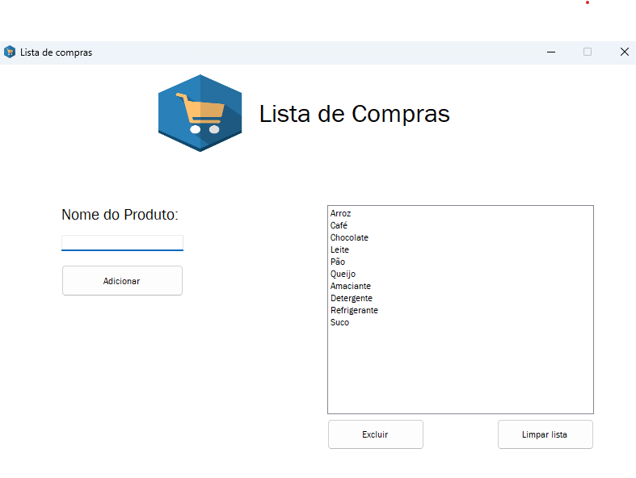

# Lista de Compras - Aplicativo em C# com Windows Forms



Este é um programa simples de gerenciamento de lista de compras, desenvolvido com C# e Windows Forms. O projeto permite adicionar, visualizar e gerenciar itens de uma lista de forma prática e intuitiva.

---

## Funcionalidades

- Adicionar itens à lista de compras usando um campo de texto
- Exibir os itens adicionados em um ListBox
- Remover um item selecionado da lista
- Limpar toda a lista com apenas um clique
- Interface simples e interativa com recursos básicos de usabilidade

---

## Objetivo do Projeto

Este projeto foi criado com o objetivo de praticar os fundamentos de programação com C# e a construção de interfaces gráficas com Windows Forms, além de aplicar princípios de usabilidade em aplicações desktop.

---

## Tecnologias Utilizadas

- Linguagem: C#
- Plataforma: .NET Framework ou .NET (dependendo da versão usada)
- Interface Gráfica: Windows Forms (WinForms)
- IDE: Visual Studio

---

## Captura de Tela

Veja abaixo a interface do aplicativo:


---

## Como Executar o Projeto

1. Clone este repositório:
   ```bash
   git clone https://github.com/seu-usuario/nome-do-repositorio.git
   ```

2. Abra o projeto no Visual Studio.

3. Compile e execute o programa (pressione `F5` ou clique em "Iniciar").

---

## Estrutura Básica

- `Form1.cs` – Código principal do formulário com a lógica de adicionar, remover e limpar itens
- `Form1.Designer.cs` – Arquivo gerado automaticamente com a estrutura da interface gráfica
- `Program.cs` – Ponto de entrada da aplicação

---

## Possíveis Melhorias Futuras

- Salvar e carregar a lista de compras em arquivos como `.txt` ou `.json`
- Marcar itens como comprados
- Adicionar categorias ou quantidades
- Exportar a lista
- Implementar atalhos de teclado para maior agilidade

---

## Licença

Este projeto está licenciado sob a MIT License. Consulte o arquivo [LICENSE](LICENSE) para mais detalhes.

---

## Autor

Desenvolvido por [Seu Nome].

Se tiver sugestões ou encontrar bugs, fique à vontade para abrir uma issue ou enviar um pull request.
